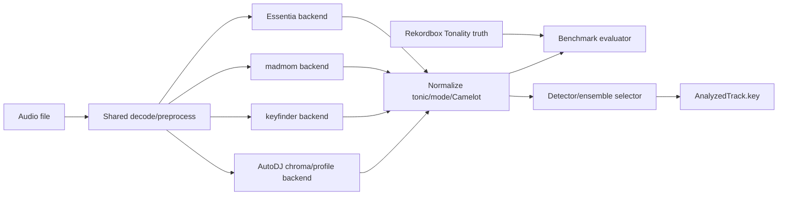

# Design Document

## Correct Framing

Rekordbox XML `Tonality` is evaluation truth, not production metadata. The
production key path must come from AutoDJ-controlled detectors. Benchmark mode
may load Rekordbox truth for comparison, but normal analysis must not copy that
truth into `AnalyzedTrack.key`.

## Current Inputs

The user's large Rekordbox export contains track-level labels:

```xml
<TRACK ... AverageBpm="140.00" Tonality="9A" ...>
```

These values become a benchmark truth table:

```json
{
  "trackId": "example-track",
  "sourceUri": "file://...",
  "truth": {
    "camelot": "9A",
    "source": "rekordbox.xml"
  }
}
```

Detector output stays separate:

```json
{
  "key": {
    "tonic": "E",
    "mode": "minor",
    "camelot": "9A",
    "confidence": 0.82,
    "candidates": [
      {
        "tonic": "E",
        "mode": "minor",
        "camelot": "9A",
        "confidence": 0.82,
        "backend": "autodj-chroma-shaath-v1"
      }
    ]
  }
}
```

## Candidate Backends

### Essentia KeyExtractor

Essentia provides a `KeyExtractor` algorithm that computes tonal features and
returns key, scale, and strength. It is a strong first candidate because the
analysis worker already lives in Python and Essentia is a serious MIR library.

Things to tune:

- sample rate and mono decode;
- frame/hop size;
- HPCP size;
- profile type where exposed;
- whether to evaluate whole track or weighted stable regions.

### madmom CNN Key Recognition

madmom exposes `CNNKeyRecognitionProcessor`, which returns probabilities over
key classes using the Korzeniowski/Widmer CNN key recognition model. This is a
model-based candidate and should be benchmarked if it installs cleanly in the
WSL environment.

Risk:

- madmom can be difficult on modern Python stacks. If it cannot be installed
  without destabilizing the analysis environment, document that and remove it
  from the active benchmark rather than leaving a fake placeholder.

### libkeyfinder / keyfinder CLI

libkeyfinder is a DJ-focused C++ key detection library used by DJ-related tools.
It is worth testing because the project ultimately needs local/offline behavior
and it may be easier to port or wrap than a Python-only stack.

Risk:

- GPL licensing constraints may make it comparison-only for a commercial app.
  Record this explicitly.

### Project-Owned Chroma/Profile Baseline

Implement a baseline we control:

1. Decode mono audio.
2. Compute chroma or CQT/CENS features.
3. Aggregate pitch-class energy over whole track or weighted stable regions.
4. Correlate against key profiles.
5. Emit ranked major/minor keys and Camelot labels.

Initial profile families:

- Krumhansl;
- Temperley if easy;
- Shaath/KeyFinder-style DJ profile;
- Faraldo/EDM-informed profile if coefficients are usable from cited work.

This baseline matters even if it loses initially, because it gives us a
portable fallback and a place to inject dubstep-specific weighting.

## Preprocessing And Tuning Ideas

Run the same audio through candidate variants before concluding a detector is
bad:

- normalize decode sample rate;
- trim leading/trailing silence;
- ignore intros/outros with weak harmonic content;
- weight verse/build/break sections more than drops if drops are noisy;
- compare whole-track key to stable-section keys;
- use beat-aligned chroma aggregation so kick/snare dominance does not swamp
  harmonic content;
- optionally generate a low-passed or harmonic-enhanced analysis signal for
  chroma extraction.

For dubstep, drops can be distorted and bass-heavy. Stable harmonic information
may be clearer in intros, verses, breaks, and builds than in the loudest drop.

## Benchmark Metrics

For each backend and variant:

- total tracks;
- scored tracks with Rekordbox truth;
- failed tracks;
- exact accuracy;
- adjacent Camelot rate;
- relative major/minor rate;
- parallel major/minor rate;
- other/miss rate;
- DJ-usable compatibility accuracy;
- median/p95 runtime per track;
- confidence calibration buckets.

Per-track rows should include:

- track ID/title;
- truth Camelot;
- predicted Camelot;
- predicted tonic/mode;
- confidence;
- error class;
- top candidate list;
- backend runtime;
- warnings.

## Selection Policy

Do not select purely by exact accuracy. Use this order:

1. Musically useful accuracy on the user's dubstep set.
2. Confidence calibration and useful ambiguity reporting.
3. Runtime and batch processing cost.
4. Installation reliability in WSL.
5. Portability/licensing path for native/mobile later.

The selected detector may be an ensemble:

- accept exact agreement between two independent candidates;
- prefer the higher-confidence ML candidate when it agrees within adjacent or
  relative Camelot distance;
- lower confidence when top candidates are distant clashes;
- fall back to the project-owned baseline if third-party candidates fail.

Selected path after the first benchmark/manual adjudication:

- Backend name: `selected-madmom-keyfinder`.
- Rule: choose `madmom-cnn-key` when its top-class confidence is at least
  `0.30`; otherwise choose `keyfinder`.
- Benchmark basis: 46/48 exact Camelot keys (95.8%) on the manually adjudicated
  48-track dubstep set.
- Known remaining misses: `They Shot To Kill` and `Lights Go Down`.
- Rekordbox XML `Tonality` remains benchmark truth only; normal analysis writes
  the selected AutoDJ detector output into `AnalyzedTrack.key`.

## Python Architecture



Proposed modules:

- `key_camelot.py`: parsing, mapping, compatibility/error classes.
- `backends/base.py`: detector protocol and result types.
- `backends/essentia_key.py`
- `backends/madmom_key.py`
- `backends/keyfinder_key.py`
- `backends/chroma_key.py`
- `backends/selected_key.py`: selected madmom/keyfinder confidence-gate
  ensemble for normal analysis.
- `key_benchmark.py`: truth loading, scoring, reports.

## C++ Planning Integration

After selection, C++ needs only normalized output:

- detected Camelot;
- tonic;
- mode;
- confidence;
- backend/provenance;
- compatibility class for candidate pairs.

The planner should treat key as a soft score until the user accepts detector
accuracy. Drop-switch build blends can prefer compatible keys, but low
confidence or unknown key should not block audition generation in the first
pass.

Implemented POC behavior:

- C++ reads `AnalyzedTrack.key` into `TrackAnalysisSummary.key`.
- Confident drop-switch clashes are downranked with
  `camelot_key_clash_downranked`.
- Compatible same-BPM drop-switch candidates can outrank a prior same-BPM clash.
- Reverb exits annotate `camelot_key_clash_warning` but remain valid.
- Missing or low-confidence keys annotate unknown compatibility and do not hard
  reject.

## CLI Shape

Candidate smoke test:

```powershell
autodj-analysis key-detectors-smoke `
  --audio-folder C:\Users\Brendan\Desktop\AutoDJTestDubstep `
  --candidates essentia,keyfinder,autodj-chroma
```

Benchmark:

```powershell
autodj-analysis benchmark-keys `
  C:\Users\Brendan\Desktop\dubstep_collection_rekordbox.xml `
  --audio-folder C:\Users\Brendan\Desktop\AutoDJTestDubstep `
  --out .autodj-cache/key-benchmark/<run-name> `
  --candidates essentia,keyfinder,autodj-chroma `
  --json
```

Normal analysis after detector selection:

```powershell
autodj-analysis analyze-batch manifest.json `
  --out .autodj-cache/analysis
```

The key backend is hard-baked into the current signal analysis path as
`selected-madmom-keyfinder`; there is no production `--key-backend` switch in
this POC step.

## Manual Gates

### Candidate Install Verdict

Before benchmarking, report which candidates are actually runnable. Remove or
defer any candidate that only fails gracefully.

### Key Benchmark Verdict

After the first full benchmark, show aggregate and per-track results. The user
decides whether to:

- select a detector;
- tune preprocessing/profile variants;
- try another model/library;
- keep key as manual/soft metadata for now.

### Key-Scored Transition Verdict

After selected detector output is wired into planning, generate a transition
candidate report. The user decides whether key can be a hard gate for any
transition family.

## Risks

- Rekordbox may disagree with musical human judgment on ambiguous EDM tracks.
- Global key may be less useful than section-local key for some transitions.
- Dubstep drops can obscure harmonic content with distortion and bass design.
- Some candidates may have licensing or installation issues.
- 90%+ strict exact agreement may be unrealistic; DJ-usable compatibility may
  be the more relevant gate for transition planning.
