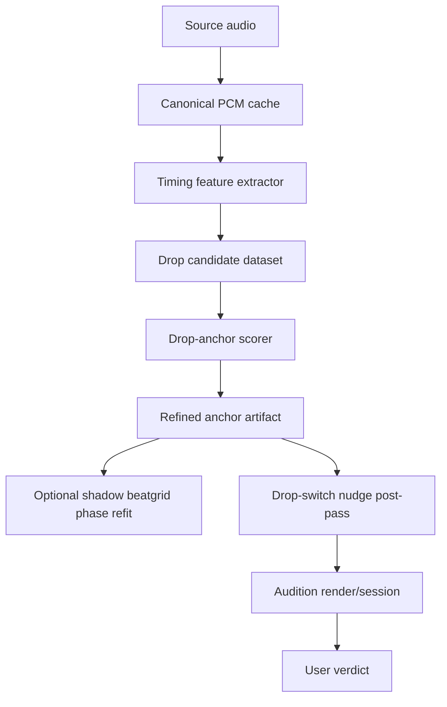

# Design Document

## Correct Framing

This spec is not another attempt to make a full semantic analyzer. It is a
timing spec.

For now, Rekordbox XML labels identify which semantic event matters: build,
drop, break, outro, and so on. AutoDJ's job is to translate those labels onto
its own canonical audio timeline, snap them to the nearest meaningful beatgrid
beat, and identify the exact transient that should align during a transition.

The reports make one point very clear: the current "find a strong nearby raw
waveform delta" method is not enough. The next attempt needs better audio views,
better provenance, and better evaluation.

## Reports: What We Use

### Directly Actionable

- Canonical PCM cache before any timing-sensitive work.
- `center=False` timing branch for STFT/onset features where supported.
- HPSS/percussive isolation before local transient work.
- Multiband onset features for kick, body/snare, and high/noise activity.
- Low-band impact and bass persistence as drop-start evidence.
- Reassigned-time and onset-backtracking candidates for sub-frame correction.
- Matched filtering or local cross-correlation around drop candidates.
- Candidate dataset export before training or default replacement.
- Strict DJ metrics measured in milliseconds, not MIR benchmark windows.

### Useful Later, Not First

- Raveform EDM model/dataset use. It is relevant, but first implementation
  should build local feature/evaluation infrastructure and verify access.
- Full custom ML model. The 48-song set is not enough for final training.
- Beat Transformer, demixed neural front ends, or drum-stem models. These may be
  valuable once canonical PCM and candidate datasets exist.
- Full self-similarity structure detection. It remains hard and is not the
  immediate blocker while Rekordbox XML labels are available.

### Explicitly Avoid

- Independent beat-by-beat snapping across a whole track.
- Hidden global BPM bias to make a benchmark pass.
- Trusting a low-confidence refined anchor without audition.
- Replacing working nudge behavior before proving the new path.

## Architecture



## Canonical PCM Cache

The cache should produce one stable decoded artifact per track and parameter
hash.

V1 recommendation:

- Use FFmpeg as the canonical decoder.
- Decode to WAV/PCM at the source sample rate when it is 44.1 kHz or 48 kHz.
- If an unsupported rate appears, resample once with FFmpeg high-quality
  settings and record it.
- Keep a mono timing PCM derivative for analysis.
- Keep stereo PCM only if a rendering path needs it. The current Python renderer
  is mono, so v1 can focus on mono timing correctness.

Artifact shape:

```json
{
  "artifactType": "canonical-audio",
  "schemaVersion": "1.0.0",
  "trackId": "example-track",
  "sourcePath": "C:/...",
  "sourceContentHash": "sha256:...",
  "canonicalPath": ".autodj-cache/.../canonical.wav",
  "decoder": {
    "name": "ffmpeg",
    "version": "...",
    "command": ["ffmpeg", "..."]
  },
  "sampleRate": 44100,
  "channels": 1,
  "durationSeconds": 186.42,
  "timelinePolicy": "shared-canonical-pcm"
}
```

All timing-sensitive artifacts should reference this canonical artifact id or
path. If a path uses `soundfile`, `librosa.load`, or another decoder directly,
it must report that it is non-canonical.

## Timing Feature Extractor

Build this as a separate module, for example:

`autodj_analysis.timing_features`

Feature branches:

1. Raw mono PCM.
2. HPSS percussive signal.
3. Low-band/kick envelope, roughly 30-150 Hz.
4. Mid/body envelope, roughly 150 Hz-3 kHz.
5. High/noise envelope, roughly 4-12 kHz.
6. Broadband spectral flux.
7. SuperFlux-style variant using `lag=1 or 2` and local max filtering.
8. Optional complex/phase onset branch if aubio or a stable local
   implementation is available.
9. Optional reassigned-time branch for candidate timing correction.

Timing parameters should default toward accuracy:

- sample rate: canonical 44.1 kHz or 48 kHz;
- timing STFT: `n_fft=512` or `1024`;
- hop: `64` or `128`;
- center: `False` for timing features;
- smoothing: short, recorded in metadata;
- feature dtype: `float32`, but aggregate fits can use `float64`.

The extractor should emit either compact JSON summaries plus an NPZ feature
store, or a JSON-only artifact for small windows. The important requirement is
that every feature value can be mapped back to source seconds deterministically.

## Drop Candidate Dataset

Add a command that consumes:

- Rekordbox XML semantic truth;
- existing analyzed-track artifacts;
- canonical PCM artifacts;
- timing feature artifacts.

CLI shape:

```powershell
autodj-analysis export-drop-candidates `
  "C:\Users\Brendan\Desktop\dubstep_collection_rekordbox.xml" `
  --analysis-root ".autodj-cache/..." `
  --out ".autodj-cache/drop-anchor-candidates/<run>" `
  --window-ms 120 `
  --json
```

Each JSONL row should represent one candidate transient near a labeled drop:

```json
{
  "trackId": "track-a",
  "cueLabel": "drop_2_start",
  "cueSeconds": 172.1,
  "nearestBeatIndex": 416,
  "nearestBeatSeconds": 172.085,
  "candidateSeconds": 172.0924,
  "candidateOffsetMsFromBeat": 7.4,
  "features": {
    "gridCloseness": 0.91,
    "rawDelta": 0.42,
    "percussiveFlux": 0.76,
    "lowBandJump": 0.88,
    "preDropDip": 0.61,
    "bassPersistence": 0.79,
    "highNoiseRise": 0.33,
    "reassignedOffsetMs": -1.2,
    "xcorrKickScore": 0.68
  },
  "autoScore": 0.82,
  "selectedBy": "drop-anchor-scorer-v1",
  "isClosestToTruth": true
}
```

This dataset is not just for ML. It is the debugging surface that lets us see
why a wrong transient was selected.

## Drop-Anchor Scorer

The scorer should be deterministic in v1. It should take candidate rows and
choose the best anchor for a semantic drop cue.

Initial score components:

- **Grid proximity:** closer to the nearest beatgrid beat is better, but not
  enough by itself.
- **Percussive onset:** HPSS/percussive branch supports true attacks over pads.
- **Low-band jump:** dubstep drops usually have kick/sub impact.
- **Pre-drop dip:** many drops have a low-energy or thinner beat immediately
  before impact.
- **Bass persistence:** a true drop usually continues with low-band energy after
  the anchor, not just a one-sample click.
- **Broadband jump:** guards against non-kick impact drops.
- **High/noise activity:** captures cymbal/noise impacts and riser releases.
- **Candidate uniqueness:** penalize ambiguous windows with several similar
  peaks unless other features agree.

Optional score components after inspection:

- **Onset backtracking:** candidate start is moved to the preceding local energy
  minimum when the detector peak lands late.
- **Reassigned-time correction:** use reassigned spectrogram times to propose a
  sub-frame correction.
- **Template cross-correlation:** compare local low-band/percussive window to a
  synthetic kick or local learned template.
- **GCC-PHAT:** only if plain correlation is unstable across song pairs.

The first implementation should expose weights as named constants or a config
file. Do not tune them blindly to one failure pair. Reports must show score
components for accepted and rejected candidates.

## Shadow Beatgrid Phase Refit

The reports argue that beatgrid alignment should be a global constrained fit.
However, previous local beat snapping made things worse. Therefore v1 should
produce a shadow artifact only:

- Keep the analyzed BPM.
- Use the refined drop anchor as a phase observation.
- Score nearby strong beat candidates across a support window, for example
  16 bars before and after the drop.
- Fit one phase offset, or a conservative piecewise offset if evidence is
  overwhelming.
- Report the original versus shadow beatgrid, but do not overwrite
  `analyzed-track.json` by default.

The shadow grid can become default only after strict metrics and audition prove
it is better.

## Drop-Switch Integration

Current working drop-switch logic should remain intact. Add a refinement-aware
path:

1. Planner creates the MixPlan using semantic cue labels and existing beatgrid.
2. Refined anchor artifact maps `fromDropStart` and `toDropStart` to exact
   candidate transient times.
3. Nudge post-pass computes the incoming source-start offset from those refined
   anchors.
4. Report writes both old raw-nudge and new refined-nudge calculations when
   comparison mode is enabled.
5. Batch auditions render both variants until the user accepts the new default.

For first acceptance, use same-native-BPM pairs. Tempo-stretch mapping adds
another variable and should be tested only after same-BPM anchor behavior is
good.

## Evaluation Metrics

Use strict project metrics:

- selected candidate offset from Rekordbox cue in ms;
- selected candidate offset from nearest beatgrid beat in ms;
- candidate rank of closest truth candidate;
- winner versus current raw nudge winner;
- median and 95th-percentile drop-anchor error over the evaluation set;
- count of high-risk ambiguous anchors;
- transition-level rendered anchor delta between A and B in samples/ms;
- user verdict per audition: perfect, acceptable, slightly off, wrong section,
  wrong transient, unusable.

Standard MIR windows such as +/-70ms are too loose for acceptance. They can be
reported for context, but they are not sufficient for this project.

## CLI Shape

Canonicalize:

```powershell
autodj-analysis canonicalize-audio `
  manifest.json `
  --out ".autodj-cache/canonical-audio/<run>" `
  --json
```

Feature extraction:

```powershell
autodj-analysis extract-timing-features `
  --analysis-root ".autodj-cache/..." `
  --canonical-root ".autodj-cache/canonical-audio/<run>" `
  --out ".autodj-cache/timing-features/<run>" `
  --json
```

Candidate export:

```powershell
autodj-analysis export-drop-candidates `
  "C:\Users\Brendan\Desktop\dubstep_collection_rekordbox.xml" `
  --analysis-root ".autodj-cache/..." `
  --timing-feature-root ".autodj-cache/timing-features/<run>" `
  --out ".autodj-cache/drop-anchor-candidates/<run>" `
  --json
```

Anchor scoring:

```powershell
autodj-analysis refine-drop-anchors `
  ".autodj-cache/drop-anchor-candidates/<run>/drop-candidates.jsonl" `
  --out ".autodj-cache/drop-anchor-refinement/<run>" `
  --json
```

Auditions:

```powershell
autodj-analysis generate-drop-anchor-auditions `
  --analysis-root ".autodj-cache/..." `
  --refined-anchor-root ".autodj-cache/drop-anchor-refinement/<run>" `
  --audio-folder "C:\Users\Brendan\Desktop\AutoDJTestDubstep" `
  --out ".autodj-cache/drop-anchor-auditions/<run>" `
  --same-bpm-only `
  --count 10
```

## Manual Gates

### canonical-pcm-verdict

Verify that generated artifacts point to the same canonical PCM and that debug
waveforms/audio playback line up in the desktop app.

### drop-candidate-feature-verdict

Inspect candidate summaries for known tracks. Confirm that the chosen feature
columns make wrong selections understandable.

### drop-anchor-audition-verdict

Listen to generated drop-switch auditions. The new path should only become
default if it beats or equals the current nudge on regression pairs and improves
known failures.

## Risks

- Canonical PCM may force cache invalidation across many existing artifacts.
- HPSS and reassigned-time features may add processing cost without improving
  dense brick-wall masters.
- Low-band features can be fooled by pre-drop sub swells or bass fills.
- A true drop may begin with a vocal/shout/noise impact rather than kick/sub.
- Rekordbox cue labels may themselves be slightly subjective or manually placed
  for DJ convenience rather than acoustic onset truth.
- Overfitting the 48-track set would make future batches worse.

